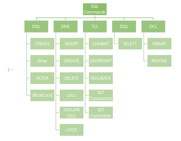
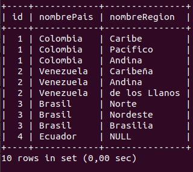

para ingresar a mysql en campuslands

```
mysql -u root -p
contraseña: campus2023
```

el usuario es:
```
mysql -u campus2023 -p
contraseña: campus2023
```

mostrar bd

```
SHOW DATABASES
```
seleccionar db

```
USE prueba;
```

CREAR DB

```
CREATE DATABASE[Nombre]
CREATE DATABASE inventario;
```

Los comandos SQL están categorizados en cinco categorías:

 -   DDL – Data Definition Language
 -   DQL – Data Query Language
 -   DML – Data Manipulation Language
 -   DCL – Data Control Language
 -   TCL – Transaction Control Language




CREAR TABLA
```
CREATE TABLE table_name (
    column1 datatype,
    column2 datatype,
    column3 datatype,
    ....
);
```

### Creando tablas para la DB inventario

```
CREATE TABLE pais (
    id INT AUTO_INCREMENT,
    nombre VARCHAR(50),
    CONSTRAINT pk_pais PRIMARY KEY(id)
);

CREATE TABLE region (
    id INT AUTO_INCREMENT,
    nombre VARCHAR(50),
    fkidpais INT(11),
    CONSTRAINT pk_region_id PRIMARY KEY (id),
    CONSTRAINT fk_pais_region_id FOREIGN KEY (fkidpais) REFERENCES pais(id)
);

CREATE TABLE ciudad (
    id INT AUTO_INCREMENT,
    nombre VARCHAR(50),
    fkidregion INT(11),
    CONSTRAINT pk_region_id PRIMARY KEY (id),
    CONSTRAINT fk_pais_ciudad_id FOREIGN KEY (fkidregion) REFERENCES region (id)
);
```

### Ver estructura de la tabla pais
```
DESCRIBE pais;
```

### Insertar datos a la BD
```
INSERT INTO pais (nombre) VALUES ("Colombia"),
("Venezuela"),
("Brasil");

INSERT INTO region (nombre, fkidpais) VALUES ("Caribe", 1), ("Pacífico", 1), ("Atlántico", 1),
 ("Caribeña",2), ("Andina", 2), ("de los Llanos", 2), ("Norte", 3), ("Nordeste", 3), ("Brasilia", 3);

 INSERT INTO ciudad (nombre, fkidregion) VALUES ("Cartagena",1),
 ("Barranquilla",1),
 ("Santa Marta",1),
 ("Buenaventura",2),
 ("Quibdó",2),
 ("Tumaco",2),
 ("Bogotá",3),
 ("Medellín",3),
 ("Bucaramanga",3),
 ("nciudad1",4),
 ("nciudad2",4),
 ("nciudad3",4),
 ("nciudad1",5),
 ("nciudad2",5),
 ("nciudad3",5),
 ("nciudad1",6),
 ("nciudad2",6),
 ("nciudad3",6),
 ("nciudad1",7),
 ("nciudad2",7),
 ("nciudad3",7),
 ("nciudad1",8),
 ("nciudad2",8),
 ("nciudad3",8),
 ("nciudad1",9),
 ("nciudad2",9),
 ("nciudad3",9);
```
SELECT
FROM
WHERE

### INNER JOIN

```
SELECT P.id, P.nombre AS nombrePais, R.nombre AS nombreRegion 
FROM pais AS P, region AS R
WHERE P.ID = R.fkidpais;
```

```
SELECT P.id, P.nombre AS nombrePais, R.nombre AS nombreRegion 
FROM pais AS P 
JOIN region AS R ON P.ID = R.fkidpais;
```

### LEFT JOIN
```
SELECT P.id, P.nombre AS nombrePais, R.nombre AS nombreRegion 
FROM pais AS P 
LEFT JOIN region AS R ON P.ID = R.fkidpais;
```
Lista todos los países incluyendo los que no tienen regiones asociadas



### LOGICOS AND OR NOT

COMP >  <  >=  <=  <>  LIKE BETWEEN
LIKE '%V%'
LIKE '%V'
LIKE 'V%'


### ELIMINAR UN DATO DE UNA TABLA
```
DELETE FROM pais WHERE id = 4;
```

### ACTUALIZAR UN DATO DE UNA TABLA
```
UPDATE ciudad 
SET nombre = "venezuelaciudad1" 
WHERE id = 10;
```
Aquí actualicé el nombre de la ciudad 1 de la primera region de venezuela

##### Listar regiones de Colombia cuya letra inicie con la letra A

SELECT R.nombre AS nombreRegion
from region AS R
INNER JOIN pais AS P ON R.fkidpais = P.id
where P.nombre = "Colombia" AND R.nombre LIKE 'A%';
