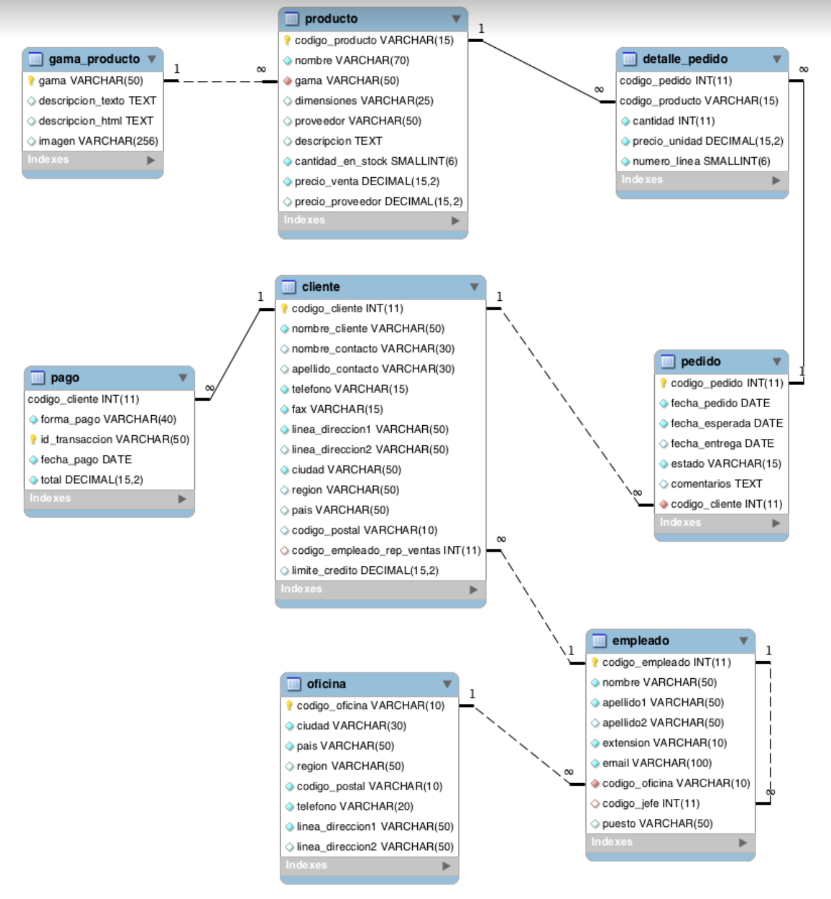
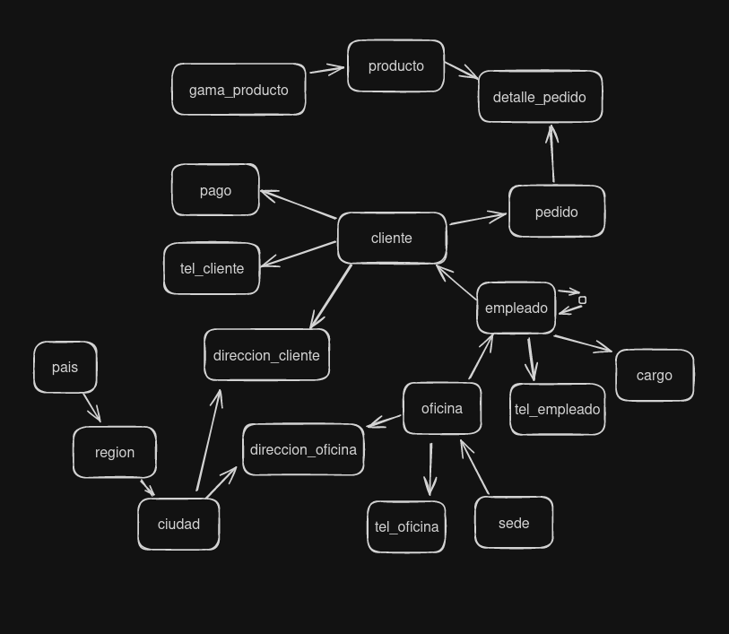
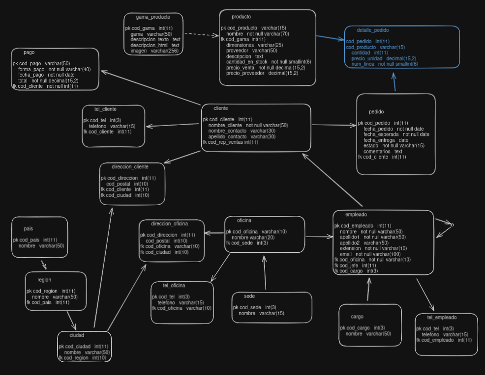
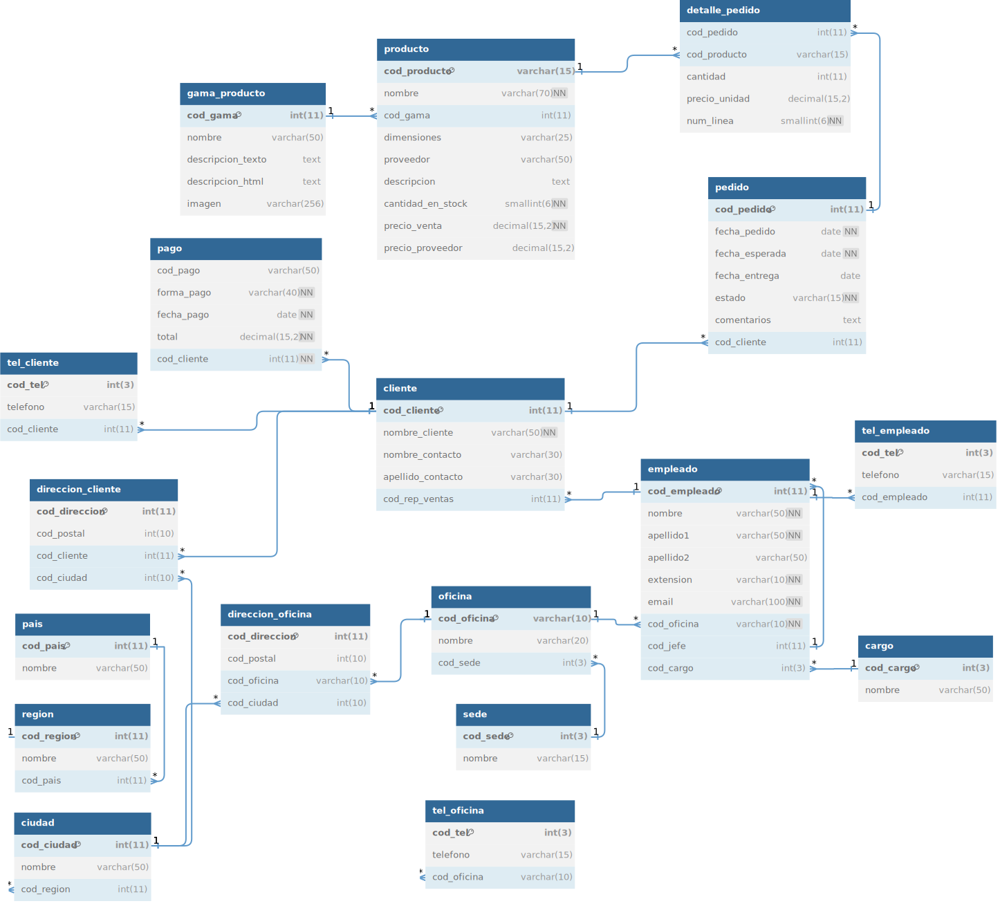

###### Este archivo contiene la documentación sobre el taller de Bases de datos del jardín

Esta es la base de datos a normalizar.


Diagrama lógico



Diagrama conceptual.


Utilicé excalidraw.com para crear el diagrama lógico y conceptual

Diagrama Físico


Utilicé la aplicación dbdiagram.io para crear el diagrama físico

## Creación de la base de datos

```sql
CREATE DATABASE garden;

USE garden;
```

## Creación de las tablas
```sql
-- Tabla gama_producto
CREATE TABLE `gama_producto` (
  `cod_gama` int(11) PRIMARY KEY,
  `nombre` varchar(50),
  `descripcion_texto` text,
  `descripcion_html` text,
  `imagen` varchar(256)
);

-- Tabla producto
CREATE TABLE `producto` (
  `cod_producto` varchar(15) PRIMARY KEY,
  `nombre` varchar(70) NOT NULL,
  `cod_gama` int(11),
  `dimensiones` varchar(25),
  `proveedor` varchar(50),
  `descripcion` text,
  `cantidad_en_stock` smallint(6) NOT NULL,
  `precio_venta` decimal(15,2) NOT NULL,
  `precio_proveedor` decimal(15,2)
);

-- Tabla pais
CREATE TABLE `pais` (
  `cod_pais` int(11) PRIMARY KEY,
  `nombre` varchar(50)
);

-- Tabla region
CREATE TABLE `region` (
  `cod_region` int(11) PRIMARY KEY,
  `nombre` varchar(50),
  `cod_pais` int(11)
);

-- Tabla ciudad
CREATE TABLE `ciudad` (
  `cod_ciudad` int(11) PRIMARY KEY,
  `nombre` varchar(50),
  `cod_region` int(11)
);

-- Tabla sede
CREATE TABLE `sede` (
  `cod_sede` int(3) PRIMARY KEY,
  `nombre` varchar(15)
);

-- Tabla oficina
CREATE TABLE `oficina` (
  `cod_oficina` varchar(10) PRIMARY KEY,
  `nombre` varchar(20),
  `cod_sede` int(3)
);

-- Tabla direccion_oficina
CREATE TABLE `direccion_oficina` (
  `cod_direccion` int(11) PRIMARY KEY,
  `cod_postal` int(10),
  `cod_oficina` varchar(10),
  `cod_ciudad` int(10)
);

-- Tabla tel_oficina
CREATE TABLE `tel_oficina` (
  `cod_tel` int(3) PRIMARY KEY,
  `telefono` varchar(15),
  `cod_oficina` varchar(10)
);

-- Tabla cargo
CREATE TABLE `cargo` (
  `cod_cargo` int(3) PRIMARY KEY,
  `nombre` varchar(50)
);

-- Tabla empleado
CREATE TABLE `empleado` (
  `cod_empleado` int(11) PRIMARY KEY,
  `nombre` varchar(50) NOT NULL,
  `apellido1` varchar(50) NOT NULL,
  `apellido2` varchar(50),
  `extension` varchar(10) NOT NULL,
  `email` varchar(100) NOT NULL,
  `cod_oficina` varchar(10) NOT NULL,
  `cod_jefe` int(11),
  `cod_cargo` int(3)
);

-- Tabla tel_empleado
CREATE TABLE `tel_empleado` (
  `cod_tel` int(3) PRIMARY KEY,
  `telefono` varchar(15),
  `cod_empleado` int(11)
);

-- Tabla cliente
CREATE TABLE `cliente` (
  `cod_cliente` int(11) PRIMARY KEY,
  `nombre_cliente` varchar(50) NOT NULL,
  `nombre_contacto` varchar(30),
  `apellido_contacto` varchar(30),
  `cod_rep_ventas` int(11)
);

-- Tabla direccion_cliente
CREATE TABLE `direccion_cliente` (
  `cod_direccion` int(11) PRIMARY KEY,
  `cod_postal` int(10),
  `cod_cliente` int(11),
  `cod_ciudad` int(10)
);

-- Tabla tel_cliente
CREATE TABLE `tel_cliente` (
  `cod_tel` int(3) PRIMARY KEY,
  `telefono` varchar(15),
  `cod_cliente` int(11)
);

-- Tabla pago
CREATE TABLE `pago` (
  `cod_pago` varchar(50),
  `forma_pago` varchar(40) NOT NULL,
  `fecha_pago` date NOT NULL,
  `total` decimal(15,2) NOT NULL,
  `cod_cliente` int(11) NOT NULL
);

-- Tabla pedido
CREATE TABLE `pedido` (
  `cod_pedido` int(11) PRIMARY KEY,
  `fecha_pedido` date NOT NULL,
  `fecha_esperada` date NOT NULL,
  `fecha_entrega` date,
  `estado` varchar(15) NOT NULL,
  `comentarios` text,
  `cod_cliente` int(11)
);

-- Tabla detalle pedido
CREATE TABLE `detalle_pedido` (
  `cod_pedido` int(11),
  `cod_producto` varchar(15),
  `cantidad` int(11),
  `precio_unidad` decimal(15,2),
  `num_linea` smallint(6) NOT NULL
);

-- Agregando Llaves foraneas
ALTER TABLE `producto` ADD FOREIGN KEY (`cod_gama`) REFERENCES `gama_producto` (`cod_gama`);

ALTER TABLE `region` ADD FOREIGN KEY (`cod_pais`) REFERENCES `pais` (`cod_pais`);

ALTER TABLE `ciudad` ADD FOREIGN KEY (`cod_region`) REFERENCES `region` (`cod_region`);

ALTER TABLE `tel_empleado` ADD FOREIGN KEY (`cod_empleado`) REFERENCES `empleado` (`cod_empleado`);

ALTER TABLE `empleado` ADD FOREIGN KEY (`cod_cargo`) REFERENCES `cargo` (`cod_cargo`);

ALTER TABLE `oficina` ADD FOREIGN KEY (`cod_sede`) REFERENCES `sede` (`cod_sede`);

ALTER TABLE `tel_oficina` ADD FOREIGN KEY (`cod_oficina`) REFERENCES `oficina` (`cod_oficina`);

ALTER TABLE `empleado` ADD FOREIGN KEY (`cod_oficina`) REFERENCES `oficina` (`cod_oficina`);

ALTER TABLE `empleado` ADD FOREIGN KEY (`cod_empleado`) REFERENCES `empleado` (`cod_jefe`);

ALTER TABLE `direccion_oficina` ADD FOREIGN KEY (`cod_ciudad`) REFERENCES `ciudad` (`cod_ciudad`);

ALTER TABLE `direccion_oficina` ADD FOREIGN KEY (`cod_oficina`) REFERENCES `oficina` (`cod_oficina`);

ALTER TABLE `pago` ADD FOREIGN KEY (`cod_cliente`) REFERENCES `cliente` (`cod_cliente`);

ALTER TABLE `cliente` ADD FOREIGN KEY (`cod_rep_ventas`) REFERENCES `empleado` (`cod_empleado`);

ALTER TABLE `tel_cliente` ADD FOREIGN KEY (`cod_cliente`) REFERENCES `cliente` (`cod_cliente`);

ALTER TABLE `pedido` ADD FOREIGN KEY (`cod_cliente`) REFERENCES `cliente` (`cod_cliente`);

ALTER TABLE `detalle_pedido` ADD FOREIGN KEY (`cod_producto`) REFERENCES `producto` (`cod_producto`);

ALTER TABLE `detalle_pedido` ADD FOREIGN KEY (`cod_pedido`) REFERENCES `pedido` (`cod_pedido`);

ALTER TABLE `direccion_cliente` ADD FOREIGN KEY (`cod_cliente`) REFERENCES `cliente` (`cod_cliente`);

ALTER TABLE `direccion_cliente` ADD FOREIGN KEY (`cod_ciudad`) REFERENCES `ciudad` (`cod_ciudad`);

```


## Insertando datos
```
-- INSERCIONES


-- Inserciones gama_producto
INSERT INTO `gama_producto` (cod_gama, nombre, descripcion_texto, descripcion_html, imagen) VALUES
(1, 'Electrónica', 'Dispositivos electrónicos avanzados.', '<p>Dispositivos electrónicos avanzados.</p>', 'electronica.jpg'),
(2, 'Hogar', 'Artículos para el hogar y decoración.', '<p>Artículos para el hogar y decoración.</p>', 'hogar.jpg'),
(3, 'Juguetes', 'Juguetes para todas las edades.', '<p>Juguetes para todas las edades.</p>', 'juguetes.jpg'),
(4, 'Ropa', 'Moda y vestimenta de calidad.', '<p>Moda y vestimenta de calidad.</p>', 'ropa.jpg'),
(5, 'Deportes', 'Artículos deportivos de alto rendimiento.', '<p>Artículos deportivos de alto rendimiento.</p>', 'deportes.jpg'),
(6, 'Libros', 'Libros y material de lectura.', '<p>Libros y material de lectura.</p>', 'libros.jpg'),
(7, 'Automotriz', 'Accesorios y piezas para autos.', '<p>Accesorios y piezas para autos.</p>', 'automotriz.jpg'),
(8, 'Jardín', 'Herramientas y decoraciones para jardín.', '<p>Herramientas y decoraciones para jardín.</p>', 'jardin.jpg'),
(9, 'Oficina', 'Material de oficina y suministros.', '<p>Material de oficina y suministros.</p>', 'oficina.jpg'),
(10, 'Salud', 'Productos de salud y bienestar.', '<p>Productos de salud y bienestar.</p>', 'salud.jpg');


-- Inserciones producto
INSERT INTO `producto` (cod_producto, nombre, cod_gama, dimensiones, proveedor, descripcion, cantidad_en_stock, precio_venta, precio_proveedor) VALUES
('P001', 'Laptop', 1, '35x25x2 cm', 'Proveedor A', 'Laptop de última generación.', 50, 1200.00, 900.00),
('P002', 'Refrigerador', 2, '70x80x180 cm', 'Proveedor B', 'Refrigerador con congelador.', 20, 600.00, 450.00),
('P003', 'Osito de Peluche', 3, '40x20x20 cm', 'Proveedor C', 'Osito de peluche suave.', 150, 25.00, 15.00),
('P004', 'Camisa', 4, 'L', 'Proveedor D', 'Camisa de algodón.', 200, 35.00, 20.00),
('P005', 'Bicicleta', 5, '150x60x100 cm', 'Proveedor E', 'Bicicleta de montaña.', 30, 350.00, 250.00),
('P006', 'Libro de Historia', 6, '20x15x5 cm', 'Proveedor F', 'Libro de historia mundial.', 120, 20.00, 10.00),
('P007', 'Llantas', 7, 'R16', 'Proveedor G', 'Llantas de alta durabilidad.', 80, 100.00, 60.00),
('P008', 'Tijeras de Jardín', 8, '25x10x5 cm', 'Proveedor H', 'Tijeras para poda.', 60, 15.00, 8.00),
('P009', 'Silla de Oficina', 9, '50x50x120 cm', 'Proveedor I', 'Silla ergonómica.', 40, 120.00, 85.00),
('P010', 'Vitaminas', 10, '10x5x5 cm', 'Proveedor J', 'Vitaminas y suplementos.', 100, 25.00, 15.00);


-- Inserciones pais
INSERT INTO `pais` (cod_pais, nombre) VALUES
(1, 'Estados Unidos'),
(2, 'Canadá'),
(3, 'México'),
(4, 'Brasil'),
(5, 'Argentina'),
(6, 'Reino Unido'),
(7, 'Francia'),
(8, 'Alemania'),
(9, 'Japón'),
(10, 'Australia');


-- Inserciones region
INSERT INTO `region` (cod_region, nombre, cod_pais) VALUES
(1, 'California', 1),
(2, 'Ontario', 2),
(3, 'Ciudad de México', 3),
(4, 'São Paulo', 4),
(5, 'Buenos Aires', 5),
(6, 'Londres', 6),
(7, 'París', 7),
(8, 'Berlín', 8),
(9, 'Tokio', 9),
(10, 'Sydney', 10);


-- Inserciones ciudad
INSERT INTO `ciudad` (cod_ciudad, nombre, cod_region) VALUES
(1, 'Los Ángeles', 1),
(2, 'Toronto', 2),
(3, 'Ciudad de México', 3),
(4, 'São Paulo', 4),
(5, 'Buenos Aires', 5),
(6, 'Londres', 6),
(7, 'París', 7),
(8, 'Berlín', 8),
(9, 'Tokio', 9),
(10, 'Sydney', 10);


-- Inserciones sede
INSERT INTO `sede` (cod_sede, nombre) VALUES
(1, 'Central'),
(2, 'Norte'),
(3, 'Sur'),
(4, 'Este'),
(5, 'Oeste'),
(6, 'Europa'),
(7, 'Asia'),
(8, 'Latam'),
(9, 'Australia'),
(10, 'África');


-- Inserciones oficina
INSERT INTO `oficina` (cod_oficina, nombre, cod_sede) VALUES
('OFC1', 'Oficina Central', 1),
('OFC2', 'Oficina Norte', 2),
('OFC3', 'Oficina Sur', 3),
('OFC4', 'Oficina Este', 4),
('OFC5', 'Oficina Oeste', 5),
('OFC6', 'Oficina Europa', 6),
('OFC7', 'Oficina Asia', 7),
('OFC8', 'Oficina Latam', 8),
('OFC9', 'Oficina Australia', 9),
('OFC10', 'Oficina África', 10);


-- Inserciones direccion_oficina
INSERT INTO `direccion_oficina` (cod_direccion, cod_postal, cod_oficina, cod_ciudad) VALUES
(1, 90001, 'OFC1', 1),
(2, 10001, 'OFC2', 2),
(3, 20001, 'OFC3', 3),
(4, 30001, 'OFC4', 4),
(5, 40001, 'OFC5', 5),
(6, 50001, 'OFC6', 6),
(7, 60001, 'OFC7', 7),
(8, 70001, 'OFC8', 8),
(9, 80001, 'OFC9', 9),
(10, 90001, 'OFC10', 10);


-- Inserciones tel_oficina
INSERT INTO `tel_oficina` (cod_tel, telefono, cod_oficina) VALUES
(1, '1234567890', 'OFC1'),
(2, '2345678901', 'OFC2'),
(3, '3456789012', 'OFC3'),
(4, '4567890123', 'OFC4'),
(5, '5678901234', 'OFC5'),
(6, '6789012345', 'OFC6'),
(7, '7890123456', 'OFC7'),
(8, '8901234567', 'OFC8'),
(9, '9012345678', 'OFC9'),
(10, '0123456789', 'OFC10');


-- Inserciones cargo
INSERT INTO `cargo` (cod_cargo, nombre) VALUES
(1, 'Gerente'),
(2, 'Subgerente'),
(3, 'Jefe de Departamento'),
(4, 'Analista'),
(5, 'Desarrollador'),
(6, 'Vendedor'),
(7, 'Soporte Técnico'),
(8, 'Marketing'),
(9, 'Recursos Humanos'),
(10, 'Contabilidad');


-- Inserciones empleado
INSERT INTO `empleado` (cod_empleado, nombre, apellido1, apellido2, extension, email, cod_oficina, cod_jefe, cod_cargo) VALUES
(1, 'John', 'Doe', 'Smith', '1001', 'john.doe@empresa.com', 'OFC1', NULL, 1),
(2, 'Jane', 'Roe', 'Doe', '1002', 'jane.roe@empresa.com', 'OFC1', 1, 2),
(3, 'Alice', 'Johnson', 'Brown', '1003', 'alice.johnson@empresa.com', 'OFC2', 1, 3),
(4, 'Bob', 'Smith', 'Johnson', '1004', 'bob.smith@empresa.com', 'OFC2', 2, 4),
(5, 'Charlie', 'Williams', 'Jones', '1005', 'charlie.williams@empresa.com', 'OFC3', 3, 5),
(6, 'David', 'Brown', 'Williams', '1006', 'david.brown@empresa.com', 'OFC3', 3, 6),
(7, 'Eve', 'Jones', 'Brown', '1007', 'eve.jones@empresa.com', 'OFC4', 4, 7),
(8, 'Frank', 'Davis', 'Smith', '1008', 'frank.davis@empresa.com', 'OFC4', 5, 8),
(9, 'Grace', 'Martinez', 'Johnson', '1009', 'grace.martinez@empresa.com', 'OFC5', 6, 9),
(10, 'Hank', 'Garcia', 'Williams', '1010', 'hank.garcia@empresa.com', 'OFC5', 7, 10);


-- Inserciones tel_empleado
INSERT INTO `tel_empleado` (cod_tel, telefono, cod_empleado) VALUES
(1, '123-456-7890', 1),
(2, '234-567-8901', 2),
(3, '345-678-9012', 3),
(4, '456-789-0123', 4),
(5, '567-890-1234', 5),
(6, '678-901-2345', 6),
(7, '789-012-3456', 7),
(8, '890-123-4567', 8),
(9, '901-234-5678', 9),
(10, '012-345-6789', 10);

-- Inserciones cliente
INSERT INTO `cliente` (cod_cliente, nombre_cliente, nombre_contacto, apellido_contacto, cod_rep_ventas) VALUES
(1, 'Acme Corp', 'Carl', 'Smith', 1),
(2, 'Globex Inc', 'Linda', 'Johnson', 2),
(3, 'Soylent Corp', 'Michael', 'Williams', 3),
(4, 'Initech', 'Sarah', 'Jones', 4),
(5, 'Hooli', 'John', 'Brown', 5),
(6, 'Umbrella Corp', 'David', 'Davis', 6),
(7, 'Stark Industries', 'Emma', 'Martinez', 7),
(8, 'Wayne Enterprises', 'James', 'Garcia', 8),
(9, 'Wonka Industries', 'Olivia', 'Lee', 9),
(10, 'Duff Beer', 'Chris', 'Kim', 10),
(11, 'Sin pago', null, 'cero', null);

-- Inserciones direccion_cliente
INSERT INTO `direccion_cliente` (cod_direccion, cod_postal, cod_cliente, cod_ciudad) VALUES
(1, 90210, 1, 1),
(2, 10001, 2, 2),
(3, 20001, 3, 3),
(4, 30001, 4, 4),
(5, 40001, 5, 5),
(6, 50001, 6, 6),
(7, 60001, 7, 7),
(8, 70001, 8, 8),
(9, 80001, 9, 9),
(10, 90001, 10, 10);


-- Inserciones tel_cliente
INSERT INTO `tel_cliente` (cod_tel, telefono, cod_cliente) VALUES
(1, '111-111-1111', 1),
(2, '222-222-2222', 2),
(3, '333-333-3333', 3),
(4, '444-444-4444', 4),
(5, '555-555-5555', 5),
(6, '666-666-6666', 6),
(7, '777-777-7777', 7),
(8, '888-888-8888', 8),
(9, '999-999-9999', 9),
(10, '000-000-0000', 10);


-- Inserciones pago
INSERT INTO `pago` (cod_pago, forma_pago, fecha_pago, total, cod_cliente) VALUES
('PAG001', 'Tarjeta de Crédito', '2024-01-15', 1500.00, 1),
('PAG002', 'Transferencia Bancaria', '2024-02-10', 2000.00, 2),
('PAG003', 'PayPal', '2024-03-05', 500.00, 3),
('PAG004', 'Tarjeta de Crédito', '2024-04-01', 750.00, 4),
('PAG005', 'Efectivo', '2024-05-20', 1200.00, 5),
('PAG006', 'Transferencia Bancaria', '2024-06-15', 3000.00, 6),
('PAG007', 'PayPal', '2024-07-10', 450.00, 7),
('PAG008', 'Efectivo', '2024-08-05', 900.00, 8),
('PAG009', 'Tarjeta de Crédito', '2024-09-01', 1100.00, 9),
('PAG010', 'Transferencia Bancaria', '2024-10-20', 2500.00, 10);
('PAG011', 'Tarjeta de Crédito', '2008-01-10', 1600.00, 1),
('PAG012', 'Transferencia Bancaria', '2008-02-15', 2100.00, 2),
('PAG013', 'PayPal', '2008-03-20', 550.00, 3),
('PAG014', 'Efectivo', '2008-04-25', 800.00, 4),
('PAG021', 'Tarjeta de Crédito', '2007-01-05', 1550.00, 1),
('PAG022', 'Transferencia Bancaria', '2007-02-10', 2050.00, 2);


-- Inserciones pedido
INSERT INTO `pedido` (cod_pedido, fecha_pedido, fecha_esperada, fecha_entrega, estado, comentarios, cod_cliente) VALUES
(1, '2024-01-01', '2024-01-15', '2024-01-14', 'Entregado', 'Ningún comentario.', 1),
(2, '2024-02-01', '2024-02-15', '2024-02-13', 'Entregado', 'Cliente satisfecho.', 2),
(3, '2024-03-01', '2024-03-15', '2024-03-14', 'Entregado', 'Entrega rápida.', 3),
(4, '2024-04-01', '2024-04-15', '2024-04-14', 'Entregado', 'Buen servicio.', 4),
(5, '2024-05-01', '2024-05-15', '2024-05-14', 'Entregado', 'Producto en buen estado.', 5),
(6, '2024-06-01', '2024-06-15', '2024-06-14', 'Entregado', 'Sin problemas.', 6),
(7, '2024-07-01', '2024-07-15', '2024-07-14', 'Entregado', 'Cliente contento.', 7),
(8, '2024-08-01', '2024-08-15', '2024-08-14', 'Entregado', 'Entrega perfecta.', 8),
(9, '2024-09-01', '2024-09-15', '2024-09-14', 'Entregado', 'Todo bien.', 9),
(10, '2024-10-01', '2024-10-15', '2024-10-14', 'Entregado', 'Sin comentarios.', 10),
(11, '2024-11-01', '2024-11-15', '2024-11-14', 'Pendiente', 'Esperando confirmación.', 1),
(12, '2024-12-01', '2024-12-15', NULL, 'Cancelado', 'Pedido cancelado por el cliente.', 2),
(13, '2024-11-10', '2024-11-25', '2024-11-24', 'En proceso', 'Procesando el pedido.', 3),
(14, '2024-12-05', '2024-12-20', NULL, 'En espera', 'En espera de stock.', 4),
(15, '2024-12-10', '2024-12-25', '2024-12-24', 'Entregado', 'Entrega rápida.', 5),
(16, '2024-11-20', '2024-12-05', NULL, 'En proceso', 'Pedido en preparación.', 6),
(17, '2024-11-25', '2024-12-10', NULL, 'Pendiente', 'Pendiente de pago.', 7),
(18, '2024-12-15', '2024-12-30', '2024-12-29', 'Entregado', 'Cliente satisfecho.', 8),
(19, '2024-12-20', '2025-01-05', NULL, 'En proceso', 'Enviado al almacén.', 9),
(20, '2024-12-25', '2025-01-10', NULL, 'Pendiente', 'Esperando confirmación.', 10);
(21, '2024-01-05', '2024-01-20', '2024-01-22', 'Entregado', 'Entrega retrasada debido a problemas logísticos.', 1),
(22, '2024-02-10', '2024-02-25', '2024-02-28', 'Entregado', 'Retraso por mal tiempo.', 2),
(23, '2024-03-15', '2024-03-30', '2024-04-02', 'Entregado', 'Demora en la aduana.', 3);


-- Inserciones detalle_pedido
INSERT INTO `detalle_pedido` (cod_pedido, cod_producto, cantidad, precio_unidad, num_linea) VALUES
(1, 'P001', 1, 1200.00, 1),
(1, 'P003', 2, 25.00, 2),
(2, 'P002', 1, 600.00, 1),
(2, 'P004', 3, 35.00, 2),
(3, 'P005', 1, 350.00, 1),
(3, 'P006', 5, 20.00, 2),
(4, 'P007', 4, 100.00, 1),
(5, 'P008', 10, 15.00, 1),
(6, 'P009', 2, 120.00, 1),
(7, 'P010', 20, 25.00, 1),
(8, 'P001', 1, 1200.00, 1),
(8, 'P002', 1, 600.00, 2),
(9, 'P003', 5, 25.00, 1),
(9, 'P004', 2, 35.00, 2),
(10, 'P005', 1, 350.00, 1),
(10, 'P006', 3, 20.00, 2);


```

## Consultas

```
 -- CONSULTAS

-- 1. Devuelve un listado con el código de oficina y la ciudad donde hay oficinas.

select O.cod_oficina as codOficina, C.nombre as nombreCiudad
from oficina as O
inner join direccion_oficina as DO on O.cod_oficina = DO.cod_oficina
inner join ciudad as C on C.cod_ciudad = DO.cod_ciudad;


-- 2. Devuelve un listado con la ciudad y el teléfono de las oficinas de España.

select C.nombre as nombreCiudad, TlO.telefono  as telOficina, O.nombre as nombreOficina
from oficina as O
inner join direccion_oficina as DO on DO.cod_oficina = O.cod_oficina
inner join ciudad as C on C.cod_ciudad = DO.cod_ciudad
inner join region as R on R.cod_region = C.cod_region
inner join pais as P on P.cod_pais = R.cod_pais
inner join tel_oficina as TlO on TlO.cod_oficina = O.cod_oficina
where P.nombre = "España";
-- Actualmente no tengo datos de oficinas en España

-- 3. Devuelve un listado con el nombre, apellidos y email de los empleados cuyo
-- jefe tiene un código de jefe igual a 7.

select E.nombre as Nombre, E.apellido1 as primerApellido, E.apellido2 as segundoApellido, E.email as correo
from empleado as E
where cod_jefe = 7;


-- 4. Devuelve el nombre del puesto, nombre, apellidos y email del jefe de la
-- empresa.

select C.nombre as Cargo, E.nombre as nombre, E.apellido1 as primerApellido, E.apellido2 as segundoApellido, E.email as correo
from empleado as E
inner join cargo as C on C.cod_cargo = E.cod_cargo
where cod_jefe is null;


-- 5. Devuelve un listado con el nombre, apellidos y puesto de aquellos
-- empleados que no sean representantes de ventas.

select C.nombre as Cargo, E.nombre as nombre, E.apellido1 as primerApellido, E.apellido2 as segundoApellido
from empleado as E
inner join cargo as C on C.cod_cargo = E.cod_cargo
where C.nombre != "Vendedor" and C.nombre != "Marketing";


-- 6. Devuelve un listado con el nombre de los todos los clientes españoles.

select Cl.nombre_cliente as nombre
from direccion_cliente as DC
inner join cliente as Cl on Cl.cod_cliente = DC.cod_cliente
inner join ciudad as Ci on Ci.cod_ciudad = DC.cod_ciudad
inner join region as R on R.cod_region = Ci.cod_region
inner join pais as P on P.cod_pais = R.cod_pais
where P.nombre = "España";
-- Actualmente no hay clientes de españa por eso el resultado es vacío, si cambiamos el país a Canada podemos encontrar el cliente: Globex Inc


-- 7. Devuelve un listado con los distintos estados por los que puede pasar un pedido.

select distinct estado
from pedido;


-- 8. Devuelve un listado con el código de cliente de aquellos clientes que
-- realizaron algún pago en 2008. Tenga en cuenta que deberá eliminar
-- aquellos códigos de cliente que aparezcan repetidos. Resuelva la consulta:

-- • Utilizando la función ADDDATE de MySQL.
select distinct Cl.cod_cliente as "código"
from cliente as Cl
inner join pago as P on P.cod_cliente = Cl.cod_cliente
where year(fecha_pago) = "2008";

-- Utilizando la función DATE_FORMAT de MySQL.
select distinct Cl.cod_cliente as "código"
from cliente as Cl
inner join pago as P on P.cod_cliente = Cl.cod_cliente
where date_format(fecha_pago, "%Y") = "2008";

-- • Sin utilizar ninguna de las funciones anteriores.
select distinct Cl.cod_cliente as "código"
from cliente as Cl
inner join pago as P on P.cod_cliente = Cl.cod_cliente
where fecha_pago between "2007-12-31" and "2008-12-31";


-- 9. Devuelve un listado con el código de pedido, código de cliente, fecha
-- esperada y fecha de entrega de los pedidos que no han sido entregados a
-- tiempo.

select P.cod_pedido as CódigoPedido, Cl.cod_cliente as CódigoCliente, P.fecha_esperada as FechaEsperada, P.fecha_entrega as FechaEntrega
from pedido as P
inner join cliente as Cl on Cl.cod_cliente = P.cod_cliente
where P.fecha_entrega > P.fecha_esperada;


-- 10. Devuelve un listado con el código de pedido, código de cliente, fecha
-- esperada y fecha de entrega de los pedidos cuya fecha de entrega ha sido al
-- menos dos días antes de la fecha esperada.

-- • Utilizando la función ADDDATE de MySQL.

select P.cod_pedido as codPedido, Cl.cod_cliente as cod_cliente, P.fecha_esperada as FechaEsperada,  P.fecha_entrega as FechaEntrega
from pedido as P
inner join cliente as Cl on Cl.cod_cliente = P.cod_cliente
where P.fecha_entrega <= ADDDATE(P.fecha_esperada, interval -2 day);


-- • Utilizando la función DATEDIFF de MySQL.

select P.cod_pedido as codPedido, Cl.cod_cliente as cod_cliente, P.fecha_esperada as FechaEsperada,  P.fecha_entrega as FechaEntrega
from pedido as P
inner join cliente as Cl on Cl.cod_cliente = P.cod_cliente
where datediff(P.fecha_esperada,P.fecha_entrega) >= 1;

-- • ¿Sería posible resolver esta consulta utilizando el operador de suma + o resta -?

select P.cod_pedido as codPedido, Cl.cod_cliente as cod_cliente, P.fecha_esperada as FechaEsperada,  P.fecha_entrega as FechaEntrega
from pedido as P
inner join cliente as Cl on Cl.cod_cliente = P.cod_cliente
where P.fecha_esperada - P.fecha_entrega >= 2;


-- 11. Devuelve un listado de todos los pedidos que fueron rechazados en 2009.
select fecha_pedido, estado
from pedido
where estado = "Rechazado" and year(fecha_pedido) = 2009;


-- 12. Devuelve un listado de todos los pedidos que han sido entregados en el mes de enero de cualquier año.

select cod_pedido, estado, fecha_entrega
from pedido
where month(fecha_entrega) = 1;


-- 13. 13. Devuelve un listado con todos los pagos que se realizaron en el año 2008 mediante Paypal. Ordene el resultado de mayor a menor.

select cod_pago, forma_pago
from pago
where forma_pago = "Paypal" and year(fecha_pago) = 2008;


-- 14. Devuelve un listado con todas las formas de pago que aparecen en la tabla pago. Tenga en cuenta que no deben aparecer formas de pago
-- repetidas.

select distinct forma_pago
from pago;


-- 15. Devuelve un listado con todos los productos que pertenecen a la gama Ornamentales y que tienen más de 100 unidades en stock. El listado
-- deberá estar ordenado por su precio de venta, mostrando en primer lugar los de mayor precio.

select G.nombre as Gama, P.cantidad_en_stock as CantidadDisponible, P.precio_venta as PrecioVenta
from producto as P  
inner join gama_producto as G on P.cod_gama = G.cod_gama
where G.nombre = "Hogar" and P.cantidad_en_stock >= 2
order by P.precio_venta;


-- 16. Devuelve un listado con todos los clientes que sean de la ciudad de Madrid y
-- cuyo representante de ventas tenga el código de empleado 11 o 30.

select Cl.nombre_cliente as Cliente
from cliente as Cl
inner join direccion_cliente as DC on Cl.cod_cliente = DC.cod_cliente
inner join ciudad as C on C.cod_ciudad = DC.cod_ciudad
inner join empleado as E on E.cod_empleado = Cl.cod_rep_ventas
where C.nombre = "Madrid" and E.cod_empleado = 11 or E.cod_empleado = 30;


-- CONSULTAS MULTITABLA

-- 1. Obtén un listado con el nombre de cada cliente y el nombre y apellido de su representante de ventas.

select Cl.nombre_cliente as nombreCliente, E.nombre as nombreRepresentante, E.apellido1 as apellidoRepresentante
from cliente as Cl
inner join empleado as E on E.cod_empleado = Cl.cod_rep_ventas;


-- 2. Muestra el nombre de los clientes que hayan realizado pagos junto con el nombre de sus representantes de ventas.

select Cl.nombre_cliente as nombreCliente, E.nombre as nombreEmpleado, P.cod_pago
from cliente as Cl
inner join pago as P on P.cod_cliente = Cl.cod_cliente
inner join empleado as E on E.cod_empleado = Cl.cod_rep_ventas;


-- 3. Muestra el nombre de los clientes que no hayan realizado pagos junto con el nombre de sus representantes de ventas.

-- Este aún falta
select Cl.nombre_cliente as nombreCliente, E.nombre as nombreEmpleado, P.cod_pago
from cliente as Cl
full join pago as P on P.cod_cliente = Cl.cod_cliente
inner join empleado as E on E.cod_empleado = Cl.cod_rep_ventas;
where not exists P.cod_cliente ;


select 


-- 4. Devuelve el nombre de los clientes que han hecho pagos y el nombre de sus representantes junto con la ciudad de la oficina a la que pertenece el representante.

select Cl.nombre_cliente as nombreCliente, E.nombre as nombreEmpleado, P.cod_pago, C.nombre as ciudadOficina
from cliente as Cl
inner join pago as P on P.cod_cliente = Cl.cod_cliente
inner join empleado as E on E.cod_empleado = Cl.cod_rep_ventas
inner join oficina as O on O.cod_oficina = E.cod_oficina
inner join direccion_oficina as DO on DO.cod_oficina = O.cod_oficina
inner join ciudad as C on C.cod_ciudad = DO.cod_ciudad;


-- 5. Devuelve el nombre de los clientes que no hayan hecho pagos y el nombre de sus representantes junto con la ciudad de la oficina a la que pertenece el representante.

select Cl.nombre_cliente as nombreCliente, E.nombre as nombreEmpleado, P.cod_pago, C.nombre as ciudadOficina
from cliente as Cl
inner join pago as P on P.cod_cliente = Cl.cod_cliente
inner join empleado as E on E.cod_empleado = Cl.cod_rep_ventas
inner join oficina as O on O.cod_oficina = E.cod_oficina
inner join direccion_oficina as DO on DO.cod_oficina = O.cod_oficina
inner join ciudad as C on C.cod_ciudad = DO.cod_ciudad
where not exists P.cod_pago;


-- 6. Lista la dirección de las oficinas que tengan clientes en Fuenlabrada.

select cod_direccion, cod_ciudad
from direccion_oficina as DO on DO.cod_ciudad = C.cod_ciudad
inner join ciudad as C 


-- 7. Devuelve el nombre de los clientes y el nombre de sus representantes junto con la ciudad de la oficina a la que pertenece el representante.

select Cl.nombre_cliente as nombreCliente, E.nombre as nombreRepresentante, E.apellido1 as apellidoRepresentante, C.nombre as CiudadOficinaRepresentante
from cliente as Cl
inner join empleado as E on E.cod_empleado = Cl.cod_rep_ventas
inner join oficina as O on O.cod_oficina = E.cod_oficina
inner join direccion_oficina as DO on DO.cod_oficina = O.cod_oficina
inner join ciudad as C on C.cod_ciudad = DO.cod_ciudad;


-- 8. Devuelve un listado con el nombre de los empleados junto con el nombre de sus jefes.


select E.nombre as nombreEmpleado, E.nombr
from empelado as E
inner join empleado as J on E.cod_jefe = J.cod_empleado


```