# Documentación de Consultas y Procedimientos Almacenados

## Consultas Requeridas

### 1. Obtener el historial de reparaciones de un vehículo específico

#### - Solución de la consulta
```sql
SELECT r.vehiculoID, r.reparacionID, 
r.fecha, 
r.costoTotal, 
r.descripcion,
 s.nombre AS servicio, e.nombre AS empleado
FROM reparacion AS r
JOIN servicio AS s ON r.servicioID = s.servicioID
JOIN empleado AS e ON r.empleadoID = e.empleadoID
WHERE r.vehiculoID = 1;

```

#### - Resultado de la consulta
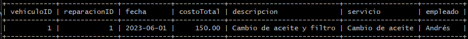


#### - Explicación de la solución
Como resultado tenemos todas las reparaciones hechas al vehiculo seleccionado que en este caso es el vehiculo con vehiculoID=1

---

### 2. Calcular el costo total de todas las reparaciones realizadas por un empleado específico en un período de tiempo

#### - Solución de la consulta
```sql
SELECT e.nombre, SUM(r.costoTotal) AS costoTotalReparaciones
FROM reparacion r
JOIN empleado e ON r.empleadoID = e.empleadoID
WHERE r.empleadoID = 1 AND r.fecha BETWEEN '2023-01-01' AND '2023-12-12'
GROUP BY e.nombre;

```

#### - Resultado de la consulta
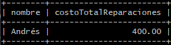

#### - Explicación de la solución
La consulta calcula el costo total de todas las reparaciones realizadas por un empleado específico que en este caso es r.empleadoID = 1 en un período de tiempo determinado. Se une la tabla reparacion con la tabla empleado para obtener el nombre del empleado y luego se filtra por empleadoID y el rango de fechas (BETWEEN '2023-01-01' AND '2023-12-12'). Finalmente, se agrupan los resultados por el nombre del empleado y se suman los costos totales de las reparaciones (SUM(r.costoTotal)).

En este caso son 2 reparaciones 1 de costo 150.00 y la otra de costo 250.00 que nos da como total 400.00

---

### 3. Listar todos los clientes y los vehículos que poseen

#### - Solución de la consulta
```sql
SELECT c.nombre AS Cliente, c.apellido AS Apellido, v.placa AS Placa, v.modelo AS Modelo, m.nombre AS Marca
FROM cliente c
JOIN vehiculo v -ON c.clienteID = v.clienteID
JOIN marca m ON v.marcaID = m.marcaID;-

```

#### - Resultado de la consulta
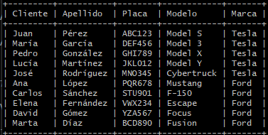

#### - Explicación de la solución
La consulta selecciona todos los clientes junto con los vehículos que poseen. Se unen las tablas cliente, vehiculo y marca para obtener la información completa del cliente, el vehículo y la marca del vehículo.

---

### 4. Obtener la cantidad de piezas en inventario para cada pieza

#### - Solución de la consulta
```sql
SELECT p.nombre AS Pieza, i.cantidad AS Cantidad, i.ubicacion AS Ubicacion
FROM pieza p
JOIN inventario i ON p.piezaID = i.piezaID;
```

#### - Resultado de la consulta
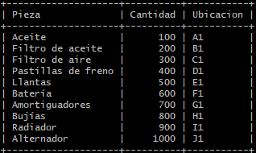

#### - Explicación de la solución
La consulta selecciona el nombre de cada pieza, la cantidad en inventario y la ubicación de cada pieza en el inventario. Se unen las tablas pieza e inventario para obtener la información completa de cada pieza en el inventario.

---

### 5. Obtener las citas programadas para un día específico

#### - Solución de la consulta
```sql
SELECT c.citaID, c.fechaHora, cl.nombre AS Cliente, cl.apellido AS Apellido, v.placa AS Placa, s.nombre AS Servicio
FROM cita c
JOIN cliente cl ON c.clienteID = cl.clienteID
JOIN vehiculo v ON c.vehiculoID = v.vehiculoID
JOIN servicio s ON c.servicioID = s.servicioID
WHERE DATE(c.fechaHora) = '2023-06-01';
```


#### - Resultado de la consulta
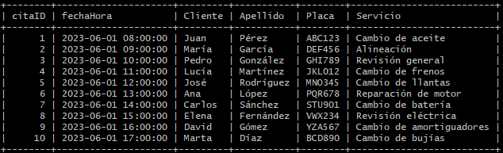

#### - Explicación de la solución
La consulta selecciona todas las citas programadas para un día específico. Se unen las tablas cita, cliente, vehiculo y servicio para obtener la información completa de cada cita, incluyendo el cliente, el vehículo y el servicio programado. La fecha se filtra utilizando la función DATE para extraer solo las citas del día especificado.

---

### 6. Generar una factura para un cliente específico en una fecha determinada

#### - Solución de la consulta
```sql
SELECT f.facturaID, f.fecha, f.total, c.nombre AS Cliente, c.apellido AS Apellido
FROM factura f
JOIN cliente c ON f.clienteID = c.clienteID
WHERE f.clienteID = 1 AND DATE(f.fecha) = '2023-06-01';
```

#### - Resultado de la consulta
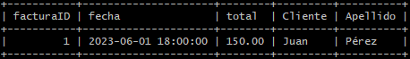

#### - Explicación de la solución
La consulta selecciona las facturas de un cliente específico (clienteID = 1) en una fecha determinada (2023-06-01). Se unen las tablas factura y cliente para obtener la información completa de la factura, incluyendo el nombre y el apellido del cliente. La consulta filtra los resultados por clienteID y la fecha de la factura utilizando la función DATE para extraer solo las facturas del día especificado.

---

### 7. Listar todas las órdenes de compra y sus detalles

#### - Solución de la consulta
```sql
SELECT oc.ordenID, oc.fecha, oc.total, e.nombre AS Empleado, p.nombre AS Proveedor, od.piezaID, od.cantidad, od.precio
FROM ordencompra oc
JOIN empleado e ON oc.empleadoID = e.empleadoID
JOIN proveedor p ON oc.proveedorID = p.proveedorID
JOIN orden_detalle od ON oc.ordenID = od.ordenID;

```

#### - Resultado de la consulta
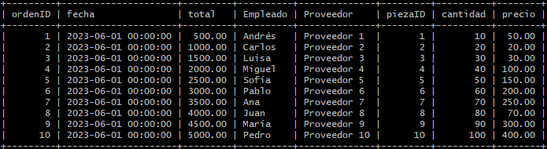

#### - Explicación de la solución
La consulta selecciona todas las órdenes de compra y sus detalles. Se unen las tablas ordencompra, empleado, proveedor y orden_detalle para obtener la información completa de cada orden de compra, incluyendo el empleado que realizó la orden, el proveedor, las piezas compradas, la cantidad de cada pieza y el precio de cada pieza.

---

### 8. Obtener el costo total de piezas utilizadas en una reparación específica

#### - Solución de la consulta
```sql
SELECT r.reparacionID, SUM(p.precio * rp.cantidad) AS costoTotalPiezas
FROM reparacion_pieza rp
JOIN pieza p ON rp.piezaID = p.piezaID
JOIN reparacion r ON rp.reparacionID = r.reparacionID
WHERE r.reparacionID = 1
GROUP BY r.reparacionID;
```

#### - Resultado de la consulta
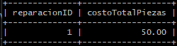

#### - Explicación de la solución
La consulta calcula el costo total de las piezas utilizadas en una reparación específica. Se unen las tablas reparacion_pieza, pieza y reparacion para obtener la información de las piezas utilizadas en cada reparación. 

La consulta multiplica el precio de cada pieza por la cantidad utilizada y luego suma estos valores (SUM(p.precio * rp.cantidad)) para obtener el costo total de las piezas para una reparación específica. 

Se filtra por reparacionID para obtener los resultados solo para la reparación específica solicitada. En este caso r.reparacionID = 1

---

### 9. Obtener el inventario de piezas que necesitan ser reabastecidas (cantidad menor que un umbral)

#### - Solución de la consulta
```sql
SELECT p.nombre AS Pieza, i.cantidad AS Cantidad, i.ubicacion AS Ubicacion
FROM inventario i
JOIN pieza p ON i.piezaID = p.piezaID
WHERE i.cantidad < 500;
```

#### - Resultado de la consulta
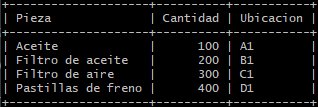

#### - Explicación de la solución
La consulta selecciona las piezas en inventario que necesitan ser reabastecidas, es decir, aquellas cuya cantidad es menor que un umbral específico. Se unen las tablas inventario y pieza para obtener la información de las piezas y sus cantidades en inventario. La consulta filtra los resultados utilizando la condición i.cantidad < 500.

---

### 10. Obtener la lista de servicios más solicitados en un período específico

#### - Solución de la consulta
```sql
SELECT s.nombre AS Servicio, COUNT(c.servicioID) AS CantidadSolicitudes
FROM cita c
JOIN servicio s ON c.servicioID = s.servicioID
WHERE c.fechaHora BETWEEN '2023-01-01' AND '2023-12-31'
GROUP BY s.nombre
ORDER BY CantidadSolicitudes DESC;
```

#### - Resultado de la consulta
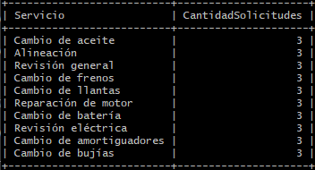

#### - Explicación de la solución
La consulta selecciona la lista de servicios más solicitados en un período específico. Se unen las tablas cita y servicio para obtener la información de las citas y los servicios correspondientes. La consulta filtra los resultados por el rango de fechas (c.fechaHora BETWEEN '2023-01-01' AND '2023-12-31'), agrupa por el nombre del servicio (GROUP BY s.nombre), y cuenta la cantidad de veces que cada servicio ha sido solicitado (COUNT(c.servicioID)). Finalmente, se ordenan los resultados en orden descendente por la cantidad de solicitudes (ORDER BY CantidadSolicitudes DESC).

---

### 11. Obtener el costo total de reparaciones para cada cliente en un período específico

#### - Solución de la consulta
```sql
SELECT c.clienteID, c.nombre AS Cliente, c.apellido AS Apellido, SUM(r.costoTotal) AS CostoTotalReparaciones, COUNT(r.reparacionID) AS cantidadReparaciones
FROM cliente c
JOIN vehiculo v ON c.clienteID = v.clienteID
JOIN reparacion r ON v.vehiculoID = r.vehiculoID
WHERE r.fecha BETWEEN '2023-01-01' AND '2023-12-31'
GROUP BY c.clienteID;
```

#### - Resultado de la consulta
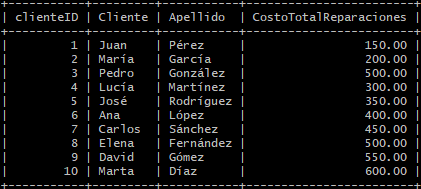

#### - Explicación de la solución
La consulta selecciona el costo total de las reparaciones para cada cliente en un período específico. Se unen las tablas cliente, vehiculo y reparacion para obtener la información necesaria. La consulta filtra las reparaciones por el rango de fechas (r.fecha BETWEEN '2023-01-01' AND '2023-12-31') y agrupa los resultados por el clienteID, el nombre y el apellido del cliente. 

Se utiliza la función SUM(r.costoTotal) para calcular el costo total de las reparaciones de cada cliente en el período especificado.

---

### 12. Listar los empleados con mayor cantidad de reparaciones realizadas en un período específico

#### - Solución de la consulta
```sql
SELECT e.empleadoID, e.nombre AS Empleado, e.apellido1, e.apellido2, COUNT(r.reparacionID) AS CantidadReparaciones
FROM empleado e
JOIN reparacion r ON e.empleadoID = r.empleadoID
WHERE r.fecha BETWEEN '2023-01-01' AND '2023-12-31'
GROUP BY e.empleadoID
ORDER BY CantidadReparaciones DESC;
```

#### - Resultado de la consulta
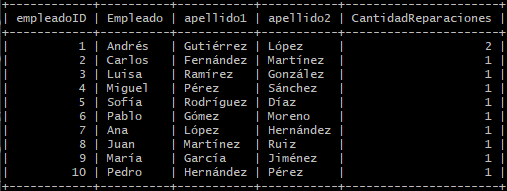

#### - Explicación de la solución
La consulta selecciona los empleados con la mayor cantidad de reparaciones realizadas en un período específico. Se unen las tablas empleado y reparacion para obtener la información necesaria. La consulta filtra las reparaciones por el rango de fechas (r.fecha BETWEEN '2023-01-01' AND '2023-12-31') y agrupa los resultados por el empleadoID. 

Se utiliza la función COUNT(r.reparacionID) para contar la cantidad de reparaciones realizadas por cada empleado. Los resultados se ordenan en orden descendente por la cantidad de reparaciones (ORDER BY CantidadReparaciones DESC).

---

### 13. Obtener las piezas más utilizadas en reparaciones durante un período específico

#### - Solución de la consulta
```sql
SELECT p.nombre AS Pieza, SUM(rp.cantidad) AS CantidadUtilizada
FROM reparacion_pieza rp
JOIN pieza p ON rp.piezaID = p.piezaID
JOIN reparacion r ON rp.reparacionID = r.reparacionID
WHERE r.fecha BETWEEN '2023-01-01' AND '2023-12-31'
GROUP BY p.nombre
ORDER BY CantidadUtilizada DESC;
```

#### - Resultado de la consulta
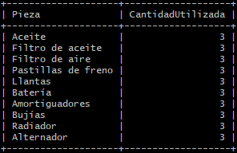

#### - Explicación de la solución
La consulta selecciona las piezas más utilizadas en reparaciones durante un período específico. Se unen las tablas reparacion_pieza, pieza y reparacion para obtener la información necesaria. La consulta filtra las reparaciones por el rango de fechas (r.fecha BETWEEN '2023-01-01' AND '2023-12-31') y agrupa los resultados por el nombre de la pieza (GROUP BY p.nombre). 

Se utiliza la función SUM(rp.cantidad) para sumar la cantidad de cada pieza utilizada en las reparaciones. Los resultados se ordenan en orden descendente por la cantidad utilizada (ORDER BY CantidadUtilizada DESC).

---

### 14. Calcular el promedio de costo de reparaciones por vehículo

#### - Solución de la consulta
```sql
SELECT v.vehiculoID, v.placa, v.modelo, AVG(r.costoTotal) AS PromedioCostoReparaciones, COUNT(r.vehiculoID) AS cantidadReparaciones
FROM vehiculo v
JOIN reparacion r ON v.vehiculoID = r.vehiculoID
GROUP BY v.vehiculoID;
```

#### - Resultado de la consulta
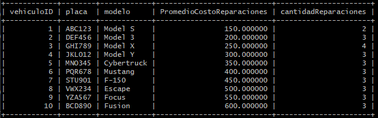

#### - Explicación de la solución
La consulta selecciona el promedio de costo de reparaciones por vehículo. Se unen las tablas vehiculo y reparacion para obtener la información necesaria. La consulta agrupa los resultados por el vehiculoID, la placa y el modelo del vehículo, y calcula el promedio del costo total de las reparaciones utilizando la función AVG(r.costoTotal).

También se muestra la cantidad de reparaciones de cada vehículo utilizando COUNT(r.vehiculoID)

---

### 15. Obtener el inventario de piezas por proveedor

#### - Solución de la consulta
```sql
SELECT pi.proveedorID, prov.nombre AS Proveedor, pi.nombre AS Pieza, i.cantidad AS Cantidad, i.ubicacion AS Ubicacion
FROM inventario i
JOIN pieza pi ON i.piezaID = pi.piezaID
JOIN proveedor prov ON pi.proveedorID = prov.proveedorID
ORDER BY pi.proveedorID, pi.nombre;
```

#### - Resultado de la consulta
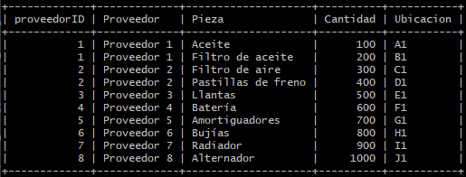

#### - Explicación de la solución
La consulta selecciona el inventario de piezas por proveedor. Se unen las tablas inventario, pieza y proveedor para obtener la información completa de cada pieza en el inventario, incluyendo el proveedor, el nombre de la pieza, la cantidad y la ubicación. Los resultados se ordenan por proveedorID y el nombre de la pieza para proporcionar una vista organizada del inventario de piezas por proveedor.

---

### 16. Listar los clientes que no han realizado reparaciones en el último año

#### - Solución de la consulta
```sql
SELECT c.clienteID, c.nombre, c.apellido, c.email
FROM cliente c
LEFT JOIN vehiculo v ON c.clienteID = v.clienteID
LEFT JOIN reparacion r ON v.vehiculoID = r.vehiculoID AND r.fecha >= DATE_SUB(CURDATE(), INTERVAL 1 YEAR)
WHERE r.reparacionID IS NULL;
```

#### - Resultado de la consulta
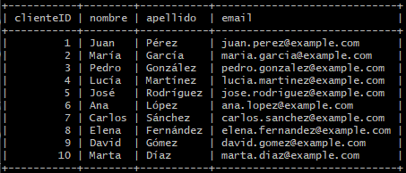

#### - Explicación de la solución
La consulta selecciona los clientes que no han realizado reparaciones en el último año. Se utilizan uniones externas (LEFT JOIN) entre las tablas cliente, vehiculo y reparacion. La condición r.fecha >= DATE_SUB(CURDATE(), INTERVAL 1 YEAR) se utiliza para limitar las reparaciones al último año. 

La condición r.reparacionID IS NULL asegura que solo se seleccionen los clientes que no tienen reparaciones en el período especificado.

---

### 17. Obtener las ganancias totales del taller en un período específico

#### - Solución de la consulta
```sql
SELECT SUM(f.total) AS GananciasTotales
FROM factura f
WHERE f.fecha BETWEEN '2023-01-01' AND '2023-12-31';
```

#### - Resultado de la consulta
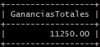

#### - Explicación de la solución
La consulta selecciona la suma total de las ganancias del taller en un período específico. Se filtra la tabla factura por el rango de fechas proporcionado (f.fecha BETWEEN '2023-01-01' AND '2023-12-31'). La función SUM(f.total) se utiliza para calcular la suma de los totales de todas las facturas dentro del período especificado, proporcionando así las ganancias totales del taller.

---

### 18. Listar los empleados y el total de horas trabajadas en reparaciones en un período específico

#### - Solución de la consulta
<!-- Incluir la solución aquí -->

#### - Resultado de la consulta
<!-- Incluir el resultado aquí -->

#### - Explicación de la solución
<!-- Incluir la explicación aquí -->

---

### 19. Obtener el listado de servicios prestados por cada empleado en un período específico

#### - Solución de la consulta
```sql
SELECT e.empleadoID, e.nombre AS Empleado, e.apellido1, e.apellido2, s.nombre AS Servicio, COUNT(r.reparacionID) AS CantidadServicios
FROM empleado e
JOIN reparacion r ON e.empleadoID = r.empleadoID
JOIN servicio s ON r.servicioID = s.servicioID
WHERE r.fecha BETWEEN '2023-01-01' AND '2023-12-31'
GROUP BY e.empleadoID, e.nombre, e.apellido1, e.apellido2, s.nombre
ORDER BY e.empleadoID, CantidadServicios DESC;
```

#### - Resultado de la consulta
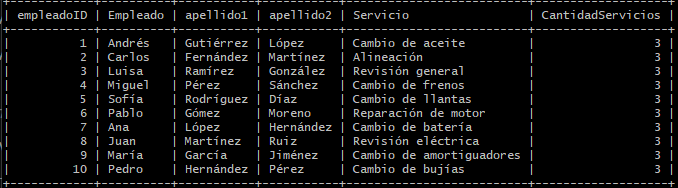

#### - Explicación de la solución
La consulta selecciona el listado de servicios prestados por cada empleado en un período específico. Se unen las tablas empleado, reparacion y servicio para obtener la información necesaria. La consulta filtra las reparaciones por el rango de fechas (r.fecha BETWEEN '2023-01-01' AND '2023-12-31'). 

Luego, se agrupan los resultados por el empleadoID, el nombre, los apellidos del empleado y el nombre del servicio, y se cuentan las reparaciones realizadas por cada empleado para cada servicio (COUNT(r.reparacionID)). Los resultados se ordenan por empleadoID y la cantidad de servicios en orden descendente (ORDER BY e.empleadoID, CantidadServicios DESC).

---

## Subconsultas

### 1. Obtener el cliente que ha gastado más en reparaciones durante el último año

#### - Solución de la consulta
```sql
SELECT c.clienteID, c.nombre, c.apellido, SUM(r.costoTotal) AS TotalGastado
FROM cliente c
JOIN vehiculo v ON c.clienteID = v.clienteID
JOIN reparacion r ON v.vehiculoID = r.vehiculoID
WHERE r.fecha >= DATE_SUB(CURDATE(), INTERVAL 4 YEAR)
GROUP BY c.clienteID, c.nombre, c.apellido
ORDER BY TotalGastado DESC
LIMIT 1;
```

#### - Resultado de la consulta
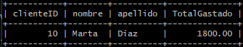

#### - Explicación de la solución
La consulta selecciona el cliente que ha gastado más en reparaciones durante los últimos 4 años debido a que no tengo datos del último año desde la fecha actual. Se unen las tablas cliente, vehiculo y reparacion para obtener la información necesaria. La consulta filtra las reparaciones realizadas en el último año (r.fecha >= DATE_SUB(CURDATE(), INTERVAL 4 YEAR)) y agrupa los resultados por el clienteID, el nombre y el apellido del cliente. 

Se utiliza la función SUM(r.costoTotal) para calcular el total gastado por cada cliente en reparaciones. Los resultados se ordenan en orden descendente por el total gastado (ORDER BY TotalGastado DESC) y se limita el resultado a un solo registro (LIMIT 1).

---

### 2. Obtener la pieza más utilizada en reparaciones durante el último mes

#### - Solución de la consulta
```sql
SELECT p.nombre AS Pieza, SUM(rp.cantidad) AS CantidadUtilizada
FROM reparacion_pieza rp
JOIN pieza p ON rp.piezaID = p.piezaID
JOIN reparacion r ON rp.reparacionID = r.reparacionID
WHERE r.fecha >= DATE_SUB(CURDATE(), INTERVAL 36 MONTH)
GROUP BY p.nombre
ORDER BY CantidadUtilizada DESC
LIMIT 1;
```

#### - Resultado de la consulta
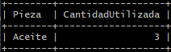

#### - Explicación de la solución
La consulta selecciona la pieza más utilizada en reparaciones durante los últimos 36 meses. Se unen las tablas reparacion_pieza, pieza y reparacion para obtener la información necesaria. La consulta filtra las reparaciones realizadas en el último mes (r.fecha >= DATE_SUB(CURDATE(), INTERVAL 36 MONTH)) y agrupa los resultados por el nombre de la pieza (GROUP BY p.nombre). 

Se utiliza la función SUM(rp.cantidad) para calcular la cantidad total de cada pieza utilizada en las reparaciones. Los resultados se ordenan en orden descendente por la cantidad utilizada (ORDER BY CantidadUtilizada DESC) y se limita el resultado a un solo registro (LIMIT 1).

---

### 3. Obtener los proveedores que suministran las piezas más caras

#### - Solución de la consulta
```sql
SELECT pi.proveedorID, prov.nombre AS Proveedor, pi.nombre AS Pieza, pi.precio
FROM pieza pi
JOIN proveedor prov ON pi.proveedorID = prov.proveedorID
ORDER BY pi.precio DESC
LIMIT 3;
```

#### - Resultado de la consulta
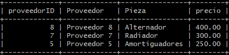

#### - Explicación de la solución
La consulta selecciona los proveedores que suministran las piezas más caras. Se unen las tablas pieza y proveedor para obtener la información necesaria. 

Los resultados se ordenan en orden descendente por el precio de la pieza (ORDER BY pi.precio DESC) y se limita el resultado a un solo registro (LIMIT 3) para obtener los tres proveedores que suministran las piezas más caras.

---

### 4. Listar las reparaciones que no utilizaron piezas específicas durante el último año

#### - Solución de la consulta
```sql
SELECT r.reparacionID, r.fecha, r.descripcion, s.nombre AS Servicio, e.nombre AS Empleado
FROM reparacion r
JOIN servicio s ON r.servicioID = s.servicioID
JOIN empleado e ON r.empleadoID = e.empleadoID
LEFT JOIN reparacion_pieza rp ON r.reparacionID = rp.reparacionID
LEFT JOIN pieza p ON rp.piezaID = p.piezaID AND p.nombre = "Alternador"
WHERE r.fecha >= DATE_SUB(CURDATE(), INTERVAL 4 YEAR) AND p.piezaID IS NULL;
```

#### - Resultado de la consulta
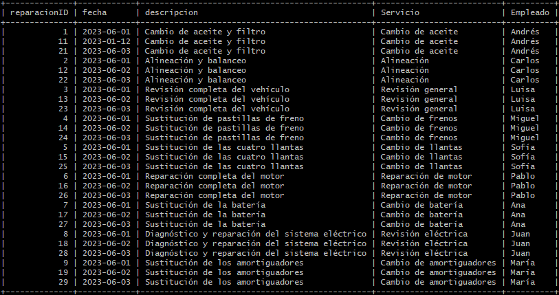

#### - Explicación de la solución
La consulta selecciona las reparaciones que no utilizaron una pieza específica durante el último año. Se unen las tablas reparacion, servicio, empleado, reparacion_pieza y pieza para obtener la información necesaria. 

La condición LEFT JOIN asegura que se incluyan todas las reparaciones, incluso aquellas que no tienen piezas asociadas. La condición p.nombre = "Alternador" permite filtrar por la pieza específica, y la condición p.piezaID IS NULL selecciona solo las reparaciones que no utilizaron esa pieza. La consulta filtra las reparaciones realizadas en los últimos cuatro años (r.fecha >= DATE_SUB(CURDATE(), INTERVAL 4 YEAR)).

---

### 5. Obtener las piezas que están en inventario por debajo del 10% del stock inicial

#### - Solución de la consulta
```sql
SELECT p.nombre AS Pieza, i.cantidad AS CantidadEnInventario, (0.1 * i.stock_inicial) AS Umbral
FROM inventario i
JOIN pieza p ON i.piezaID = p.piezaID
WHERE i.cantidad < (0.1 * i.stock_inicial);
```


#### - Resultado de la consulta
<!-- Incluir el resultado aquí -->

#### - Explicación de la solución
<!-- Incluir la explicación aquí -->

---

## Procedimientos Almacenados

### 1. Crear un procedimiento almacenado para insertar una nueva reparación

#### - Solución del procedimiento
```sql
DELIMITER //

CREATE PROCEDURE InsertarReparacion (
    IN p_reparacionID INT,
    IN p_fecha DATE,
    IN p_costoTotal DOUBLE,
    IN p_descripcion TEXT,
    IN p_vehiculoID INT,
    IN p_servicioID INT,
    IN p_empleadoID INT
)
BEGIN
    INSERT INTO reparacion (reparacionID, fecha, costoTotal, descripcion, vehiculoID, servicioID, empleadoID)
    VALUES (p_reparacionID, p_fecha, p_costoTotal, p_descripcion, p_vehiculoID, p_servicioID, p_empleadoID);
END //

DELIMITER ;
```

#### - Resultado del procedimiento
```sql
CALL InsertarReparacion(31,'2024-01-01', 500.00, 'Reparación de frenos', 1, 4, 2);
```
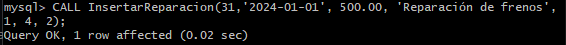

#### - Explicación de la solución
El procedimiento almacenado InsertarReparacion permite insertar una nueva reparación en la tabla reparacion. Se definen seis parámetros de entrada (p_fecha, p_costoTotal, p_descripcion, p_vehiculoID, p_servicioID, p_empleadoID) que representan los datos necesarios para la inserción. Dentro del procedimiento, se ejecuta una sentencia INSERT INTO para añadir un nuevo registro a la tabla reparacion con los valores proporcionados como parámetros. El uso del delimitador (DELIMITER //) es necesario para definir el cuerpo del procedimiento almacenado y luego restablecer el delimitador (DELIMITER ;) al final.

---

### 2. Crear un procedimiento almacenado para actualizar el inventario de una pieza

#### - Solución del procedimiento almacenado
```sql
DELIMITER //

CREATE PROCEDURE ActualizarInventario (
    IN p_inventarioID INT,
    IN p_piezaID INT,
    IN p_cantidad INT,
    IN p_ubicacion VARCHAR(30)
)
BEGIN
    UPDATE inventario
    SET cantidad = p_cantidad,
        ubicacion = p_ubicacion
    WHERE inventarioID = p_inventarioID
    AND piezaID = p_piezaID;
END //
DELIMITER ;
```

#### - Resultado del procedimiento
```sql
CALL ActualizarInventario(1, 1, 120, 'B2');
```
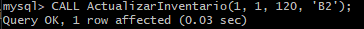

#### - Explicación de la solución
El procedimiento almacenado ActualizarInventario permite actualizar la cantidad y la ubicación de una pieza específica en el inventario. 

Se definen cuatro parámetros de entrada (p_inventarioID, p_piezaID, p_cantidad, p_ubicacion) que representan el ID del inventario, el ID de la pieza, la nueva cantidad en inventario y la nueva ubicación. Dentro del procedimiento, se ejecuta una sentencia UPDATE para cambiar la cantidad y la ubicación de la pieza en la tabla inventario con los valores proporcionados como parámetros.

 El uso del delimitador (DELIMITER //) es necesario para definir el cuerpo del procedimiento almacenado y luego restablecer el delimitador (DELIMITER ;) al final.

---

### 3. Crear un procedimiento almacenado para eliminar una cita

#### - Solución de la consulta
```sql
DELIMITER //

CREATE PROCEDURE EliminarCita (
    IN p_citaID INT
)
BEGIN
    DELETE FROM cita
    WHERE citaID = p_citaID;
END //

DELIMITER ;
```

#### - Resultado de la consulta
```sql
CALL EliminarCita(1);
```
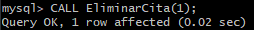
#### - Explicación de la solución
El procedimiento almacenado EliminarCita permite eliminar una cita de la tabla cita. 

Se define un parámetro de entrada (p_citaID) que representa el ID de la cita que se desea eliminar. Dentro del procedimiento, se ejecuta una sentencia DELETE FROM para eliminar el registro correspondiente en la tabla cita con el citaID proporcionado. 

El uso del delimitador (DELIMITER //) es necesario para definir el cuerpo del procedimiento almacenado y luego restablecer el delimitador (DELIMITER ;) al final.

---

### 4. Crear un procedimiento almacenado para generar una factura

#### - Solución de la consulta
<!-- Incluir la solución aquí -->

#### - Resultado de la consulta
<!-- Incluir el resultado aquí -->

#### - Explicación de la solución
<!-- Incluir la explicación aquí -->

---

### 5. Crear un procedimiento almacenado para obtener el historial de reparaciones de un vehículo

#### - Solución de la consulta
<!-- Incluir la solución aquí -->

#### - Resultado de la consulta
<!-- Incluir el resultado aquí -->

#### - Explicación de la solución
<!-- Incluir la explicación aquí -->

---

### 6. Crear un procedimiento almacenado para calcular el costo total de reparaciones de un cliente en un período

#### - Solución de la consulta
<!-- Incluir la solución aquí -->

#### - Resultado de la consulta
<!-- Incluir el resultado aquí -->

#### - Explicación de la solución
<!-- Incluir la explicación aquí -->

---

### 7. Crear un procedimiento almacenado para obtener la lista de vehículos que requieren mantenimiento basado en el kilometraje

#### - Solución de la consulta
<!-- Incluir la solución aquí -->

#### - Resultado de la consulta
<!-- Incluir el resultado aquí -->

#### - Explicación de la solución
<!-- Incluir la explicación aquí -->

---

### 8. Crear un procedimiento almacenado para insertar una nueva orden de compra

#### - Solución de la consulta
<!-- Incluir la solución aquí -->

#### - Resultado de la consulta
<!-- Incluir el resultado aquí -->

#### - Explicación de la solución
<!-- Incluir la explicación aquí -->

---

### 9. Crear un procedimiento almacenado para actualizar los datos de un cliente

#### - Solución de la consulta
<!-- Incluir la solución aquí -->

#### - Resultado de la consulta
<!-- Incluir el resultado aquí -->

#### - Explicación de la solución
<!-- Incluir la explicación aquí -->

---

### 10. Crear un procedimiento almacenado para obtener los servicios más solicitados en un período

#### - Solución de la consulta
<!-- Incluir la solución aquí -->

#### - Resultado de la consulta
<!-- Incluir el resultado aquí -->

#### - Explicación de la solución
<!-- Incluir la explicación aquí -->

---
